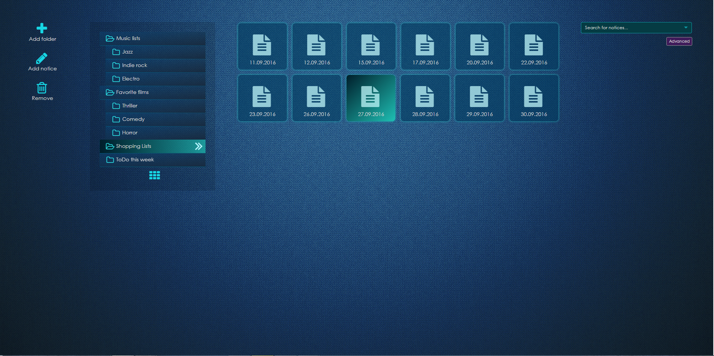

# Note Manager

This is a simple app to manage notices and directories. Created for learning purpose.

## Getting Started

The repo includes two separate applications - backend and front part.

To run the backend you should:

1. ```cd react-practice-backend```
2. Run ```npm i```
3. Run ```node.server.js```


To run front part:

1. ```cd front-part```
2. Run ```npm i```
3. Run ```npm start```
4.pen your browser on: ```http://localhost:3000/```.


You should see:




## Built With

The front part is created with React, Redux and redux-thunk, ReactDnD, ES2015 with Babel, SemanticUI, CSS Modules.

## Authors

* Front part - Dominik Broj
* Backend - Maxim Knyazev
